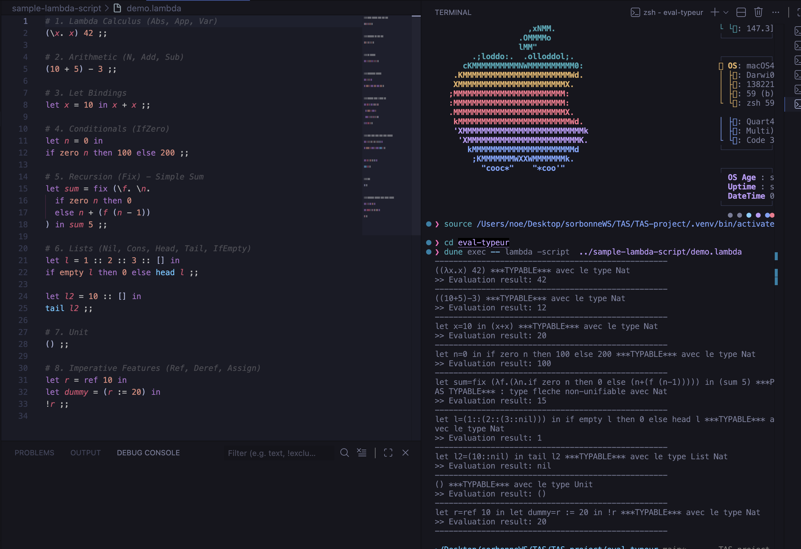
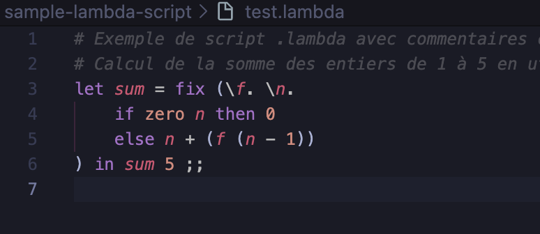
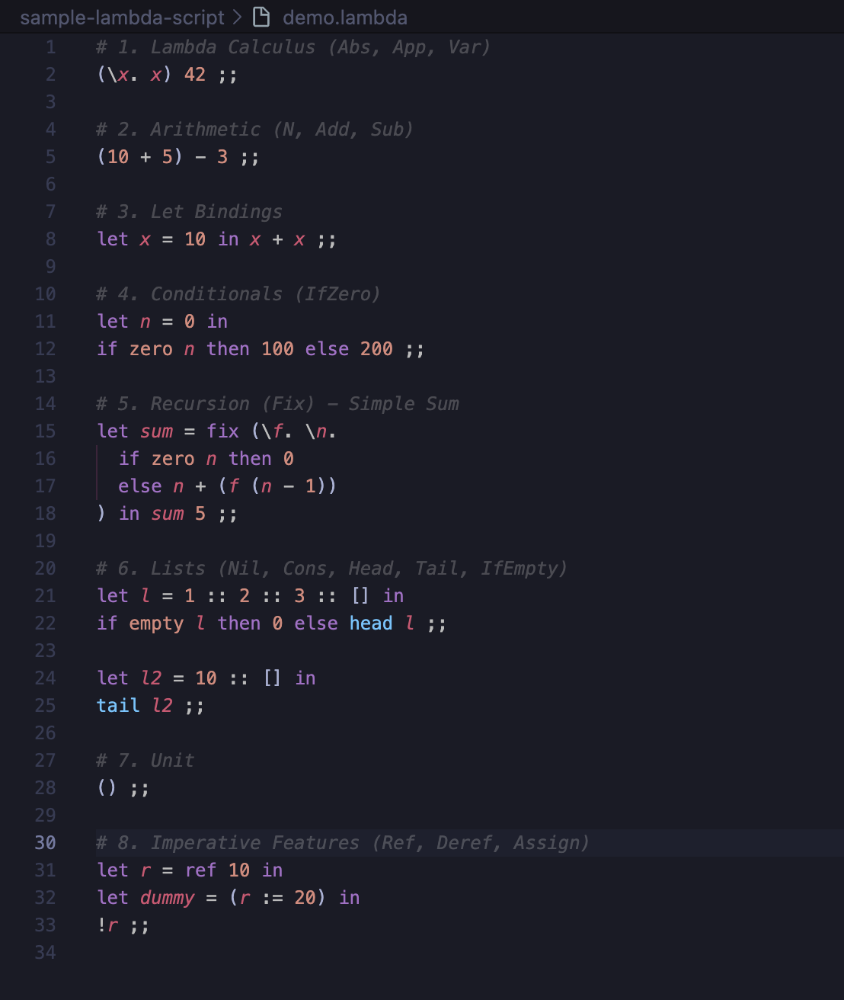
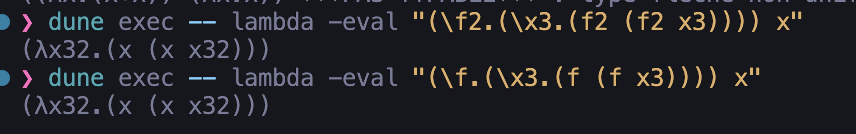
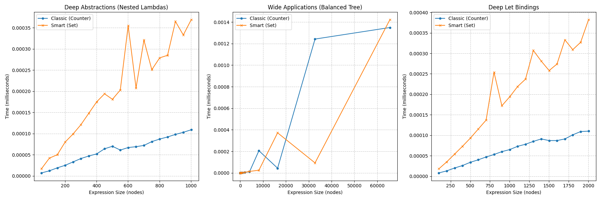

```
    __                    __        __            ______                __
   / /   ____ _____ ___  / /_  ____/ /___ _      / ____/___ _____ ___  / /
  / /   / __ `/ __ `__ \/ __ \/ __  / __ `/_____/ /   / __ `/ __ `__ \/ /
 / /___/ /_/ / / / / / / /_/ / /_/ / /_/ /_____/ /___/ /_/ / / / / / / /
/_____/\__,_/_/ /_/ /_/_.___/\__,_/\__,_/      \____/\__,_/_/ /_/ /_/_/

```


*Plus jolis avec des couleurs non ?*

## Contribution
### Requis

* Terme et Types de lambda calcul
* Pretty-printer
* Évaluateur
* Algorithme d'inférence de types
* Extensions du langage :
  * Arithmétique (Entiers, Opérations)
  * Structures de contrôle (IfZero, Let)
  * Récursion (Fix)
  * Listes
  * Traits impératifs (Références)

### Bonus

* Lexer-Parser avec
* Benchmarking de deux algorithmes d'alpha-conversion
* script .lambda avec semi-colon et commentaires
* cli pour evaluer/typer un fichier .lambda
  * A la maniere du compilateur tryocaml, pas de print
* Extension vscode pour .lambda script avec coloration syntaxique


# Eval-Typeur Lambda Calcul

Project Ocaml Dune pour simuler un evaluateur-typeur de Lambda calcul.

## Prérequis

- OCaml (recommandé: 4.12+)
- Dune (>= 2.0)
- opam (optionnel, pour gérer les dépendances)

```bash
cd eval-typeur
# Créer un switch local (optionnel)
opam switch create . --empty

# Installer les dépendances du projet
opam install . --deps-only
```

## Setup

```bash
cd eval-typeur
# Compiler le projet
dune build

# Exécuter les tests
dune runtest

# Run main
dune exec main

# run with a lambda script file (eval and type)
dune exec -- lambda -script  ../sample-lambda-script/demo.lambda
```

## Structure

```bash
eval-typeur
├── bin
│   ├── dune
│   └── main.ml                  #  Main qui teste quelques exemples de l’évaluateur-typeur
├── cli
│   ├── dune
│   └── cli.ml                   # CLI pour évaluer/typer un fichier .lambda ou des terme passé en arguments
├── lib
│   ├── dune
│   ├── ast.ml                   # définitions des termes et types
│   ├── parser.ml                # lexer-parser
│   ├── printer.ml               # pretty-printer pour termes et types
│   ├── evaluation.ml            # sémantique (évaluateur)
│   └── typeur.ml                # moteur d’inférence de types (HM polymorphe)
└── test
    ├── dune
    ├── benchmark_alpha.ml       # benchmark alpha conversion
    ├── plot_benchmark.py        # script de visualisation des benchmarks
    └── test_lambda.ml           # tests unitaires pour parser/éval/typeur
```

## Example d'usage

### Extrait pour un main.ml


```ocaml
(* --- Évaluation --- *)

(* Application et Arithmétique *)
let term = parsePTERM "(\\x.(\\y.(y + x))) 4 5" ;;
print_endline (print_term (eval term)) ;;
(* Résultat : 9 *)

(* Listes *)
let l = parsePTERM "head (1 :: (2 :: nil))" ;;
print_endline (print_term (eval l)) ;;
(* Résultat : 1 *)

(* Structures de contrôle (Let) *)
let let_term = parsePTERM "let x = 10 in x + 1" ;;
print_endline (print_term (eval let_term)) ;;
(* Résultat : 11 *)

(* --- Inférence de Types --- *)

(* Identité (Polymorphe) *)
let ex_id = Abs ("x", Var "x") ;;
print_endline (inference ex_id) ;;
(* Type : (A -> A) *)

(* Combinateur S *)
let ex_s = Abs ("x", Abs ("y", Abs ("z",
    App (App (Var "x", Var "z"), App (Var "y", Var "z"))))) ;;
print_endline (inference ex_s) ;;
(* Type : ((A -> (B -> C)) -> ((A -> B) -> (A -> C))) *)

(* Fonction sur les entiers *)
let ex_nat = Abs ("x", Add (Var "x", Var "x")) ;;
print_endline (inference ex_nat) ;;
(* Type : (Nat -> Nat) *)
```

Output
```
9
1
11
(λx.x) ***TYPABLE*** avec le type (T2->T2)
(λx.(λy.(λz.((x z) (y z))))) ***TYPABLE*** avec le type ((T11->(T9->T8))->((T11->T9)->(T11->T8)))
(λx.(x+x)) ***TYPABLE*** avec le type (Nat->Nat)
```


### extrait pour un script .lambda

```test.lambda```
```ocaml
# Exemple de script .lambda avec commentaires et semi-colons
# Calcul de la somme des n premiers entiers
let rec sum = fix \f.\n.
    if zero n then 0
    else n + (f (n - 1))
in
sum 5 ;;
```

commande
``` dune exec -- lambda -script  ../sample-lambda-script/test.lambda```

output
```
--------------------------------------------------
let sum=fix (λf.(λn.if zero n then 0 else (n+(f (n-1))))) in (sum 5) ***PAS TYPABLE*** : type fleche non-unifiable avec Nat
>> Evaluation result: 15
--------------------------------------------------
```

**evaluation seulement** >> ``` dune exec -- lambda -eval  ../sample-lambda-script/test.lambda -eval-only```

**typage seulement** >> ``` dune exec -- lambda -type  ../sample-lambda-script/test.lambda -type-only```


**expression en argument** >> ``` dune exec -- lambda -expr "(\x.x) 42" ```

## Higjhlighter VSCode pour les fichiers .lambda ```lambda-extension```

Une extension VSCode pour la coloration syntaxique des fichiers `.lambda` est incluse dans le répertoire `lambda-extension`. Pour l'utiliser :

```sh install_highlight_extension.sh```

ou directement :

```
cp -r eval-typeur/lambda-extension ~/.vscode/extensions/lambda-extension
```

resultat






## Exemples du Parser

| Syntaxe Concrète | AST Résultant (OCaml) |
| :--- | :--- |
| `\x.x` | `Abs ("x", Var "x")` |
| `(\x.x) 42` | `App (Abs ("x", Var "x"), N 42)` |
| `1 + 2` | `Add (N 1, N 2)` |
| `let x = 5 in x` | `Let ("x", N 5, Var "x")` |
| `if zero n then 0 else 1` | `IfZero (Var "n", N 0, N 1)` |
| `1 :: nil` | `Cons (N 1, Nil)` |
| `fix \f.f` | `Fix (Abs ("f", Var "f"))` |
| `(\\x.(\\y.(y + x))) 4 5` | `App (App (Abs ("x", Abs ("y", Add (Var "y", Var "x"))), N 4), N 5)` |


## Gestion des erreurs

* **Parsing** : Levée de l'exception `Parse_err` avec message explicite (ex: "missing )", "expected 'in'") dans `lib/parser.ml`.
* **Typage** : Levée de `Echec_unif` pour les conflits de types (ex: "type fleche non-unifiable"), capturée dans `inference` pour afficher `***PAS TYPABLE***` (`lib/typeur.ml`).
* **Évaluation** : Gestion des boucles infinies via un paramètre `timeout`, on limite le nombre d'etape maximal d'evaluation, si depassé on leve une exception `Eval_timeout`.

## Evaluation avec trace

L'algorithme `eval` suit ces étapes :

1. **Initialisation** : Reset du store (`store := []`) et alpha-conversion.
2. **Boucle** :
    * **Timeout** : Arrêt si `n <= 0`.
    * **Réduction** : `delta_reduce` après `beta_reduce`.
    * **Point fixe** : Retourne `t` si `t' = t`.
    * **Trace** : Affiche le terme si `trace` est actif.
    * **Récursion** : Continue avec `n - 1`.

```ocaml
let term5 =
  parsePTERM "((\\x.(\\y.(y + x))) 4)  ((\\n.(\\f.(\\x.(f (n f x))))) 5)"
;;

print_endline (print_term (eval ~trace:true term5)) ;;
```

Output avec trace (a chaque etape :

```
[0] (((λx11.(λy12.(y12+x11))) 4) ((λn8.(λf9.(λx10.(f9 ((n8 f9) x10))))) 5))
[1] ((λy12.(y12+4)) ((λn8.(λf9.(λx10.(f9 ((n8 f9) x10))))) 5))
[2] (((λn8.(λf9.(λx10.(f9 ((n8 f9) x10))))) 5)+4)
[3] ((λf9.(λx10.(f9 ((5 f9) x10))))+4)
((λf9.(λx10.(f9 ((5 f9) x10))))+4)
```


## Benchmark Alpha Conversion
J'ai deux implémentations de l'algorithme recursif d'alpha-conversion, une qui renomme toute les variables a gauche, et une optimisée qui ne renomme que les variables en collision. Le benchmark montre que l'implémentation optimisée est significativement plus rapide, surtout pour les termes avec beaucoup de variables.

### Exemple de terme testé

$(λf.λx.(f(f x)))x$

alpha-convertion naïve:

$((λf2.(λx3.(f2 (f2 x3)))) x)$

alpha-convertion avec un set de variables libres:
$((λf.(λx1.(f (f x1)))) x)$

example trouvé dans la vidéo a 24:15

<https://www.youtube.com/watch?v=9MtE5ONrQyk&t=597s>

avec une evaluation exactement identique.


### Résultats du Benchmark

Les trois graphiques ci-dessous illustrent la performance sur différentes structures de termes :

1. **Deep Abstractions** : Termes avec beaucoup de lambdas imbriquées (`\x.\x...`). L'écart est énorme car l'algo naïf renomme tout récursivement.
2. **Wide Applications** : Arbres d'applications larges. L'écart est plus faible car la structure est moins profonde, mais le set reste meilleur.
3. **Deep Let Bindings** : Imbrications de `let`. Confirme que l'optimisation est cruciale pour les structures de contrôle courantes.



On peux conclure que l'ecart de perfromance reste extremement faible au vu des ecart de grandeurs de l'axes du temps, cela dit l'implementatiojn avec set de variable est moins performante.

Après analyse de la complexité, alpha_convert est à O(n) à O(n²) dans le pire des cas (beaucoup de collisions), tandis que alpha_convert_with_set est O(n log n) à O(n²) dans le pire des cas (beaucoup de collisions et gestion du set).

Aucune difference lors de l'evaluation, autant choisir alpha_convert.


## Tests

test_lambda.ml contient des tests unitaires pour le parser, l’évaluateur et le typeur, grace au parser et au LLMs, on peut facilement écrire des tests en language naturel pour vérifier le comportement du code, cependant il faut s'assurer de verifier la pertinence du tests genéré.

| Catégorie | Nom du test | Description |
|---|---|---|
| **print_term** | simple lambda | Vérifie l'affichage de `(λx.x)` |
| | application and addition | Vérifie l'affichage de `((f 2)+3)` |
| | subtraction | Vérifie l'affichage de `(5-3)` |
| | cons/head/tail | Vérifie l'affichage des listes `(1::nil)`, `head`, `tail` |
| | conditionals and fix | Vérifie l'affichage de `if zero`, `if empty`, `fix` |
| | let binding | Vérifie l'affichage de `let x=1 in (x+2)` |
| **print_type** | Nat | Vérifie l'affichage du type `Nat` |
| | variable type | Vérifie l'affichage d'une variable de type `A` |
| | arrow simple | Vérifie l'affichage de `(X->Nat)` |
| | arrow nested | Vérifie l'affichage de `(X->(Nat->Y))` |
| | deeply nested | Vérifie l'affichage complexe `((Nat->A)->(B->(Nat->C)))` |
| | list | Vérifie l'affichage de `List (Nat->Nat)` |
| | forall | Vérifie l'affichage de `Forall X.(X->List X)` |
| | consistency | Vérifie la cohérence globale de l'affichage des types |
| **lexer** | simple expression | Tokenisation de `\x.x + 3` |
| | parentheses & numbers | Tokenisation de `((\f.f) 42)` |
| | subtraction | Tokenisation de `5 - 3` |
| | let binding | Tokenisation de `let x = 1 in x` |
| | list & cond | Tokenisation de `if empty [] then head xs else tail xs` |
| | cons | Tokenisation de `1 :: []` |
| **parser** | identity | Parse `\x.x` en `Abs ("x", Var "x")` |
| | nested lambda | Parse `\x.\y.(x y)` |
| | addition | Parse `1 + 2 + 3` |
| | subtraction | Parse `5 - 3` |
| | application | Parse `((\f.f) (\x.x))` |
| | complex expression | Parse `(\f.\x.(f x)) 5 + 3` |
| | let | Parse `let x = 1 in x + 2` |
| | fix | Parse `fix \f.f` |
| | if empty | Parse `if empty [] then 1 else 2` |
| | cons | Parse `1 :: []` |
| **evaluation** | beta: identity application | Réduction `(\x.x) 5` -> `5` |
| | beta: const function | Réduction `(\x.\y.x) 7` -> `(\y.7)` |
| | delta: 1+2 | Réduction arithmétique `1 + 2` -> `3` |
| | delta: nested addition | Réduction `(1 + 2) + 3` -> `6` |
| | beta then delta | Réduction combinée `(\x.x) (1 + 2)` -> `3` |
| | eval expression | Évaluation complète `(\x.(\y.(y + x))) 4 5` -> `9` |
| | eval timeout | Vérifie l'arrêt sur terme divergent (Omega) |
| | eval trace consistency | Vérifie que le mode trace ne modifie pas le résultat |
| **typeur** | ex_id | Typage identité `\x.x` (Typable) |
| | ex_k | Typage K `\x.\y.x` (Typable) |
| | ex_s | Typage S `\x.\y.\z...` (Typable) |
| | ex_omega | Typage Omega (Non Typable - Occurs Check) |
| | ex_nat1 | Typage `(\x.x+1) 3` -> `Nat` |
| | ex_nat2 | Typage `\x.x+x` -> `Nat -> Nat` |
| | ex_nat3 | Typage `(\x.x+x) (\x.x)` (Non Typable - Clash) |
| | let_id | Polymorphisme Let `let id = \x.x in id` |
| | let_poly_app | Application polymorphe `id id` |
| | let_poly_reuse | Réutilisation polymorphe dans Let |
| | fail_mono | Échec monomorphisme lambda `\f. f f` |
| | ref creation | Typage `ref 1` -> `Ref Nat` |
| | deref | Typage `!r` -> `Nat` |
| | assign | Typage `r := 2` -> `Unit` |
| | assign effect | Vérifie l'effet de bord à l'exécution |
| | typeur ref | Inférence `ref` |
| | typeur deref | Inférence `deref` |
| | typeur assign | Inférence `assign` |
| **alpha_convert** | no collision | Pas de collision de variables |
| | collision | Renommage forcé sur collision |
| | nested shadowing | Gestion du masquage (shadowing) |
| | performance | Benchmark de performance |

